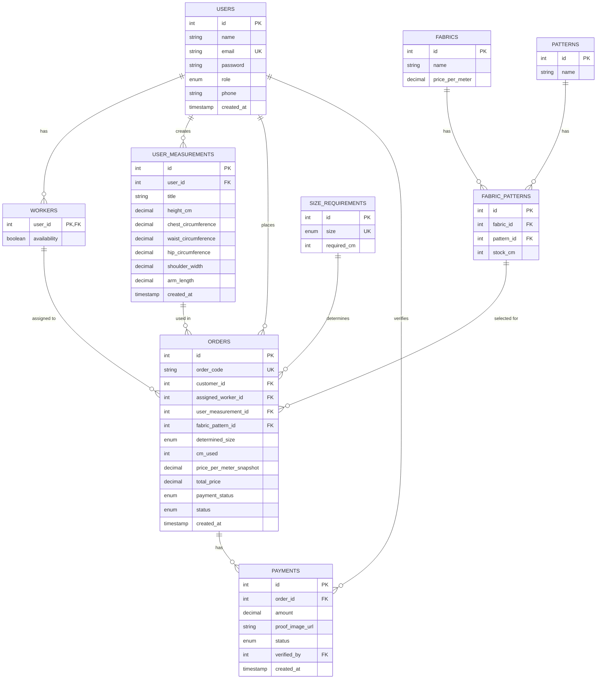

# Entity Relationship Diagram - Tailor Management System

## Mermaid ERD Diagram



## Data Dictionary

### USERS Table
| Field | Type | Constraints | Description |
|-------|------|-------------|-------------|
| id | INT | PK, AUTO_INCREMENT | Unique user identifier |
| name | VARCHAR(100) | NOT NULL | User's full name |
| email | VARCHAR(100) | NOT NULL, UNIQUE | Email address |
| password | VARCHAR(255) | NOT NULL | Hashed password |
| role | ENUM | NOT NULL, DEFAULT 'customer' | User role: customer, admin, worker |
| phone | VARCHAR(20) | | Contact phone number |
| created_at | TIMESTAMP | DEFAULT CURRENT_TIMESTAMP | Account creation time |

### WORKERS Table
| Field | Type | Constraints | Description |
|-------|------|-------------|-------------|
| user_id | INT | PK, FK(users.id) | Reference to worker user |
| availability | BOOLEAN | NOT NULL, DEFAULT TRUE | Whether worker can accept new orders |

### USER_MEASUREMENTS Table
| Field | Type | Constraints | Description |
|-------|------|-------------|-------------|
| id | INT | PK, AUTO_INCREMENT | Unique measurement ID |
| user_id | INT | NOT NULL, FK(users.id) | Reference to customer |
| title | VARCHAR(50) | NOT NULL | Name of measurement profile |
| height_cm | DECIMAL(5,2) | | Height in centimeters |
| chest_circumference | DECIMAL(5,2) | NOT NULL | Chest measurement |
| waist_circumference | DECIMAL(5,2) | NOT NULL | Waist measurement |
| hip_circumference | DECIMAL(5,2) | | Hip measurement |
| shoulder_width | DECIMAL(5,2) | | Shoulder width |
| arm_length | DECIMAL(5,2) | | Arm length |
| created_at | TIMESTAMP | DEFAULT CURRENT_TIMESTAMP | Creation timestamp |

### FABRICS Table
| Field | Type | Constraints | Description |
|-------|------|-------------|-------------|
| id | INT | PK, AUTO_INCREMENT | Unique fabric ID |
| name | VARCHAR(100) | NOT NULL | Fabric name/type |
| price_per_meter | DECIMAL(10,2) | NOT NULL | Price per meter |

### PATTERNS Table
| Field | Type | Constraints | Description |
|-------|------|-------------|-------------|
| id | INT | PK, AUTO_INCREMENT | Unique pattern ID |
| name | VARCHAR(100) | NOT NULL | Pattern name/design |

### FABRIC_PATTERNS Table (Junction)
| Field | Type | Constraints | Description |
|-------|------|-------------|-------------|
| id | INT | PK, AUTO_INCREMENT | Unique combination ID |
| fabric_id | INT | NOT NULL, FK(fabrics.id) | Reference to fabric |
| pattern_id | INT | NOT NULL, FK(patterns.id) | Reference to pattern |
| stock_cm | INT | NOT NULL, DEFAULT 0 | Stock in centimeters |
| | | UNIQUE(fabric_id, pattern_id) | Each combination unique |

### SIZE_REQUIREMENTS Table
| Field | Type | Constraints | Description |
|-------|------|-------------|-------------|
| id | INT | PK, AUTO_INCREMENT | Unique size ID |
| size | ENUM | NOT NULL, UNIQUE | Standard size (XS-XXL) |
| required_cm | INT | NOT NULL | Fabric needed for this size |

### ORDERS Table
| Field | Type | Constraints | Description |
|-------|------|-------------|-------------|
| id | INT | PK, AUTO_INCREMENT | Unique order ID |
| order_code | VARCHAR(50) | NOT NULL, UNIQUE | Order reference code |
| customer_id | INT | NOT NULL, FK(users.id) | Reference to customer |
| assigned_worker_id | INT | FK(workers.user_id), NULLABLE | Assigned worker |
| user_measurement_id | INT | NOT NULL, FK(user_measurements.id) | Selected measurement profile |
| fabric_pattern_id | INT | NOT NULL, FK(fabric_patterns.id) | Selected fabric-pattern |
| determined_size | ENUM | NOT NULL | Final size (XS-XXL) |
| cm_used | INT | NOT NULL | Actual fabric consumed |
| price_per_meter_snapshot | DECIMAL(10,2) | NOT NULL | Price at order time |
| total_price | DECIMAL(10,2) | NOT NULL | Total order price |
| payment_status | ENUM | NOT NULL, DEFAULT 'unpaid' | unpaid, paid |
| status | ENUM | NOT NULL, DEFAULT 'pending' | pending, in progress, finished |
| created_at | TIMESTAMP | DEFAULT CURRENT_TIMESTAMP | Order timestamp |

### PAYMENTS Table
| Field | Type | Constraints | Description |
|-------|------|-------------|-------------|
| id | INT | PK, AUTO_INCREMENT | Unique payment ID |
| order_id | INT | NOT NULL, FK(orders.id) | Reference to order |
| amount | DECIMAL(10,2) | NOT NULL | Payment amount |
| proof_image_url | VARCHAR(255) | | URL to payment proof |
| status | ENUM | NOT NULL, DEFAULT 'pending' | pending, verified, rejected |
| verified_by | INT | FK(users.id), NULLABLE | Admin who verified |
| created_at | TIMESTAMP | DEFAULT CURRENT_TIMESTAMP | Payment timestamp |

## Constraints and Triggers

### Foreign Key Constraints
- All foreign keys enforce referential integrity
- Cascading delete on users (workers, measurements, payments cascade)
- Set NULL on worker deletion from orders

### Unique Constraints
- users.email - Email must be unique per user
- orders.order_code - Order code must be unique
- fabric_patterns(fabric_id, pattern_id) - Each fabric-pattern combination unique
- size_requirements.size - Each size appears once

### Triggers

#### TRIGGER: trg_after_user_insert
**Event**: AFTER INSERT ON users

**Logic**:
```sql
IF NEW.role = 'worker' THEN
    INSERT INTO workers (user_id, availability)
    VALUES (NEW.id, TRUE);
END IF;
```

#### TRIGGER: trg_after_user_update
**Event**: AFTER UPDATE ON users

**Logic**:
```sql
IF NEW.role = 'worker' AND OLD.role != 'worker' THEN
    INSERT INTO workers (user_id, availability)
    VALUES (NEW.id, TRUE)
    ON DUPLICATE KEY UPDATE availability = TRUE;
ELSEIF NEW.role != 'worker' AND OLD.role = 'worker' THEN
    DELETE FROM workers WHERE user_id = NEW.id;
END IF;
```

## Relationship Details

### One-to-One Relationships
- **USERS ↔ WORKERS**: User with role='worker' → Workers table entry (enforced by triggers)

### One-to-Many Relationships
- **USERS → USER_MEASUREMENTS**: Customer can have multiple measurement profiles
- **USERS → ORDERS**: Customer can place multiple orders
- **USER_MEASUREMENTS → ORDERS**: A measurement profile can be used in multiple orders
- **FABRICS → FABRIC_PATTERNS**: Fabric combined with multiple patterns
- **PATTERNS → FABRIC_PATTERNS**: Pattern combined with multiple fabrics
- **ORDERS → PAYMENTS**: Order can have multiple payment records
- **WORKERS → ORDERS**: Worker can be assigned to multiple orders

## Common Queries

### Get order with all details
```sql
SELECT 
    o.order_code,
    u.name AS customer,
    w.name AS assigned_worker,
    um.title AS measurement_profile,
    f.name AS fabric,
    p.name AS pattern,
    o.determined_size,
    o.cm_used,
    sr.required_cm,
    o.total_price,
    o.payment_status,
    o.status
FROM orders o
JOIN users u ON o.customer_id = u.id
LEFT JOIN workers w ON o.assigned_worker_id = w.user_id
JOIN user_measurements um ON o.user_measurement_id = um.id
JOIN fabric_patterns fp ON o.fabric_pattern_id = fp.id
JOIN fabrics f ON fp.fabric_id = f.id
JOIN patterns p ON fp.pattern_id = p.id
JOIN size_requirements sr ON o.determined_size = sr.size
WHERE o.id = ?;
```

### Check fabric pattern stock
```sql
SELECT 
    f.name AS fabric,
    p.name AS pattern,
    fp.stock_cm,
    COUNT(o.id) AS orders_pending_fulfillment
FROM fabric_patterns fp
JOIN fabrics f ON fp.fabric_id = f.id
JOIN patterns p ON fp.pattern_id = p.id
LEFT JOIN orders o ON o.fabric_pattern_id = fp.id 
    AND o.status IN ('pending', 'in progress')
GROUP BY fp.id;
```

### Worker availability and workload
```sql
SELECT 
    u.id,
    u.name,
    w.availability,
    COUNT(o.id) AS active_orders
FROM workers w
JOIN users u ON w.user_id = u.id
LEFT JOIN orders o ON o.assigned_worker_id = w.user_id 
    AND o.status IN ('pending', 'in progress')
GROUP BY w.user_id
ORDER BY w.availability DESC, active_orders ASC;
```
